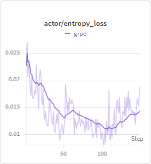
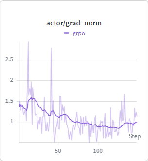
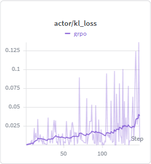
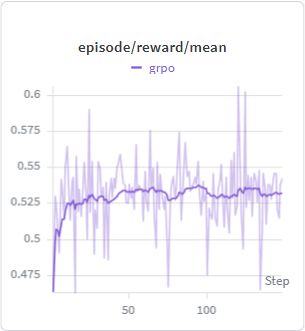

<table>
  <tr>
    <td align="center">
       
      Entropy Loss
    </td>
    <td align="center">
       
      Gradient Norm
    </td>
  </tr>
  <tr>
    <td align="center">
       
      KL Loss
    </td>
    <td align="center">
       
      Reward
    </td>
  </tr>
</table>
